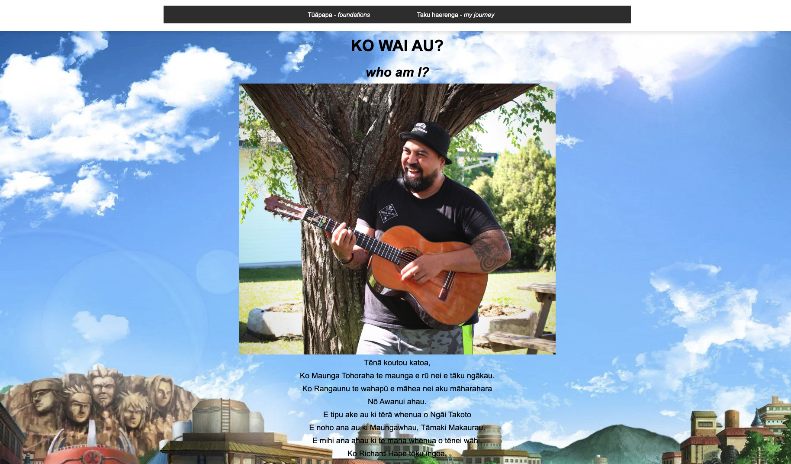

# My Journey

Welcome to **My Journey**, a personal growth blog project designed by you for you.

## Table of Contents

- [Project Overview](#project-overview)
- [Folder Structure](#folder-structure)
- [Features](#features)
- [Getting Started](#getting-started)
- [Contributing](#contributing)
<!-- - [License](#license) -->

## Project Overview & Features

The **My Journey** project provides the basics for a learner's personal development through HTML pages. It encourages students to explore the following aspects:

1. **About Me**: A personal page to introduce yourself to readers.
2. **Individual Learning Plan**: A structured plan to outline personal and academic goals.
3. **Well-being Plan**: A well-being plan based on Te Whare Tapa Whā the Māori Health Framework created by Tā Mason Durie.
4. **Self-transformation Programme**: Learnings based on **Atomic Habits** and a **Growth Mindset** and more.

This project will also allow you to practice web development by using HTML and CSS.

<!-- ## Features -->

<!-- - **About Me Page**: A simple page where learners can introduce themselves.
- **Learning Plan**: A framework for learners to set and track personal goals.
- **Well-being Plan**: A section dedicated to nurturing self-care and mindfulness.
- **Self-transformation Programme**:
  - **Atomic Habits**: Learners can document their learnings from the popular book and worksheets and apply the habit-building techniques into their lives.
  - **Growth Mindset**: A space for students to reflect on adopting a growth mindset for learning and self-improvement. -->

## Getting Started

1. **Clone the repository**:
   To get started, clone this repository to your local machine using the following command:

   ```bash
   git clone https://github.com/your-username/my-journey.git

2. **Where to next**:
   Begin by introducing yourself on the **index.html** page. At this stage we only expect you to complete the **About Me** part of your project.
   example:
   
